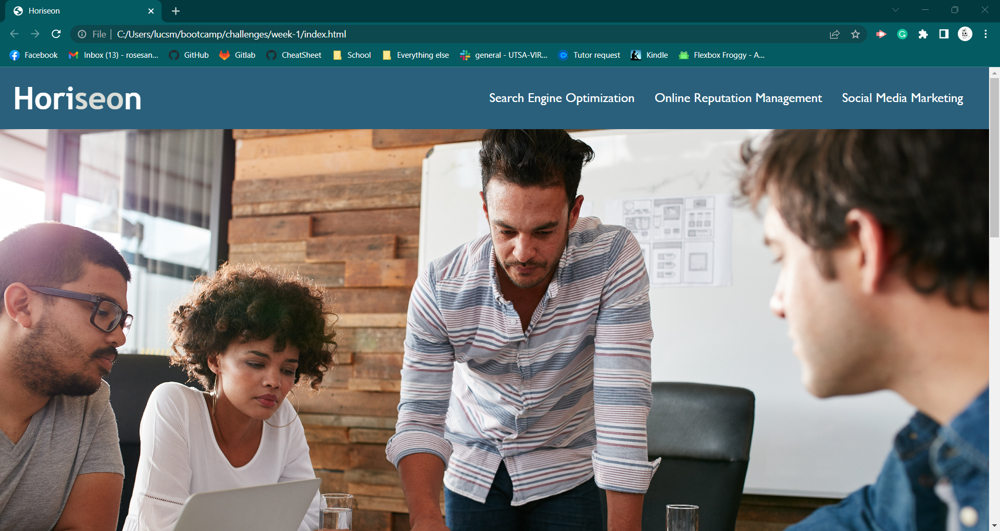
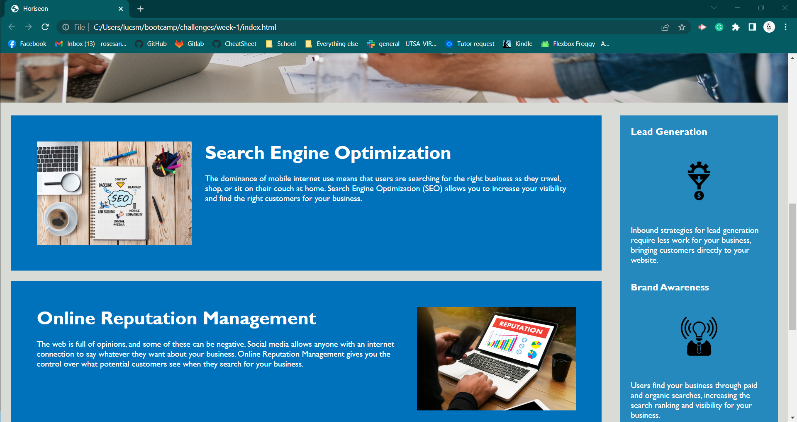
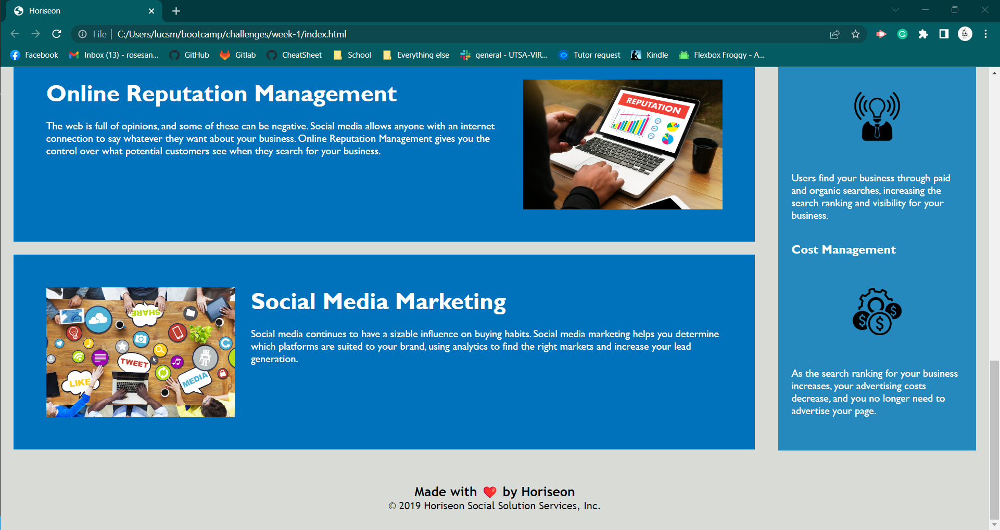

Horiseon-Acessibility
UTSA Project 1-
https://github.com/rosesandbooks89/week-1

This is a short, simple description of a feature told from the perspective of the person who is requesting the new capability, usually a user or customer of the system. This follows an AS AN / I WANT / SO THAT format. For example, "AS A shopper visiting an online store, I WANT to place items in a shopping cart, SO THAT I can purchase them."

Acceptance Criteria:

GIVEN a webpage meets accessibility standards
WHEN I view the source code
THEN I find semantic HTML elements
WHEN I view the structure of the HTML elements
THEN I find that the elements follow a logical structure independent of styling and positioning
WHEN I view the icon and image elements
THEN I find accessible alt attributes
WHEN I view the heading attributes
THEN they fall in sequential order
WHEN I view the title element
THEN I find a concise, descriptive title

Changed tags to semantic tags to make them available for accessibility. 

added alt tags to images to make more accessible

This project taught me the importance of using semantic tags, and how they are applied to webpages. 

